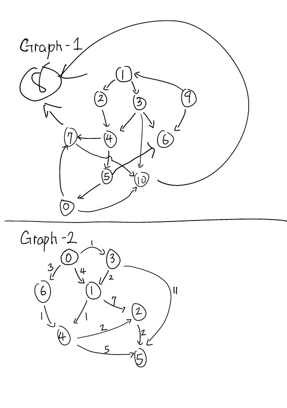

# Important note

Please continue your work on top of `homework 1` in the same repository because you will need code from homework 1 to be working in order to accomplish homework 2. Once you are done with homework 2, you may open another Pull Request.

# Description

**Search**

In this homework, we are going to implement BFS and DFS continue on top of our data structure (Graph) that you implemented in homework 1.

* Being able to find path between two nodes using either BFS or DFS

Here is a quick review of [lessson 2](../notes/general-search.md)

**Pictures worth a thousand word**

Below is the graph visualization, you should use this homework description to debug the graph traversal in BFS and DFS.




**Example**

Assume I give a test on BFS and DFS from node 1 to 8, they (BFS and DFS) will generate different result due to the nature of the implementation (one goes by depth and one goes by level).

```java
graph.search(BFS(), new Node(1), new Node(8));
// returns a list of edge from node 1 to 7 and node 7 to 8
graph.search(DFS(), new Node(1), new Node(8));
// returns a list of edge from node 1 to 2, node 2 to 4, 
// node 4 to 7 and node 7 to 8
```

# Tasks

1. Implement BFS and DFS methods in `BFS.java` and `DFS.java`
2. Verify implementation via provided unit tests
3. ~~Solve maze escape game~~ (due to the time constraint)

# Deliverable

* Github Pull Requests (be sure to pass all unit tests)

:no_entry_sign: DO NOT MODIFY ANY EXISTING CODES :no_entry_sign:

# Grading Rubric

* Pass BFS unit tests [5 pts]
* Pass DFS unit tests [5 pts]
* Bonus Question - Implement `Game` interface to create bot save princess game we discuss in class [2 pts]
