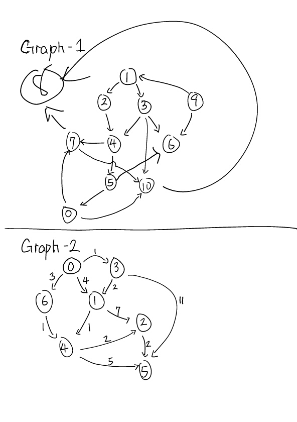

# Important note

Continue from your homework 2.

# Description

**Dijkstra's Algorithm**

**Pictures worth a thousand word**



Dijkstra will find shortest path in regards of the total edge cost

Example:

```
graph2.search(new Dijkstra(), new Node(0), new Node(5));
// should return 0, 6, 4, 5 with total cost of 9
```

**A***

Grid-1.txt
```
+----------------------------------------+
|######@1      ############@8      ######|
|######        ##        ##        ######|
|####      ####            ####      ####|
|##      ####  ##        ##  ####      ##|
|####    @6                          ####|
|##########                    ##########|
|############  ####    ####  ############|
|  ##@2        ############        @3##  |
|            ################            |
|        ########################        |
|        ########################        |
|            ################            |
|  ##          ############          ##  |
|############  ####    ####  ############|
|##########  @4            @5  ##########|
|####                                ####|
|##      ####  ##        ##  ####      ##|
|####      ####            ####      ####|
|######        ##        ##        ######|
|######      @7############        ######|
+----------------------------------------+
```

**Description**

Your job of A* implementation starts with reading the above graph as text file just like how you read the file from each representation. And generate path accordingly (N, E, W, S) as list of string to the destination.

**Bonus**: Use our `Graph` class to solve this problem than solving it manually.  
*Hint*: we will dynamically add more edges from consumer of `Graph`. In other word, for each tile on the map, you want to construct a `Node` and for each path between tile you want to construct an `Edge` class.

Graph specification as below:
1. Each Tile contains two column spaces in the same row
2. Wall is represented as `##`
3. Each key point is represented as `@1` 1 as the id of the key point
4. Empty tile is represented as two empty space `  `

Your job in this assignment is to read the grid and dynamically generate the routes from key point 1 to other key points. In example, from key point 1 to key point 6, you will go through 5 empty spaces going south and then go east to key point 6.

It is also possible to solve the problem using BFS; however, I'll add timeout on each method and expecting your method to finish within certain period.

# Tasks

1. Implement AStar and Dijkstra methods in `AStar.java` and `Dijkstra.java`
2. Implement `parseGridFile()` method in `AStarTest.java`
2. Verify implementation via provided unit tests

# Deliverable

* Github Pull Requests (be sure to pass all unit tests)

:no_entry_sign: DO NOT MODIFY ANY EXISTING CODES :no_entry_sign:

> but you can add more methods and variables as you go

# Grading Rubric

* Pass `AStarTest.java` [5 pts]
    * Pass unit tests [3 pts]
    * Coding style and minor details [2 pts]
* Pass `DijkstraTest.java` [5 pts]
    * Pass all unit tests [3 pts]
    * Coding style and minor details [2 pts]
* Bonus Question - Solve A* using our Graph class rather than solving it plainly
