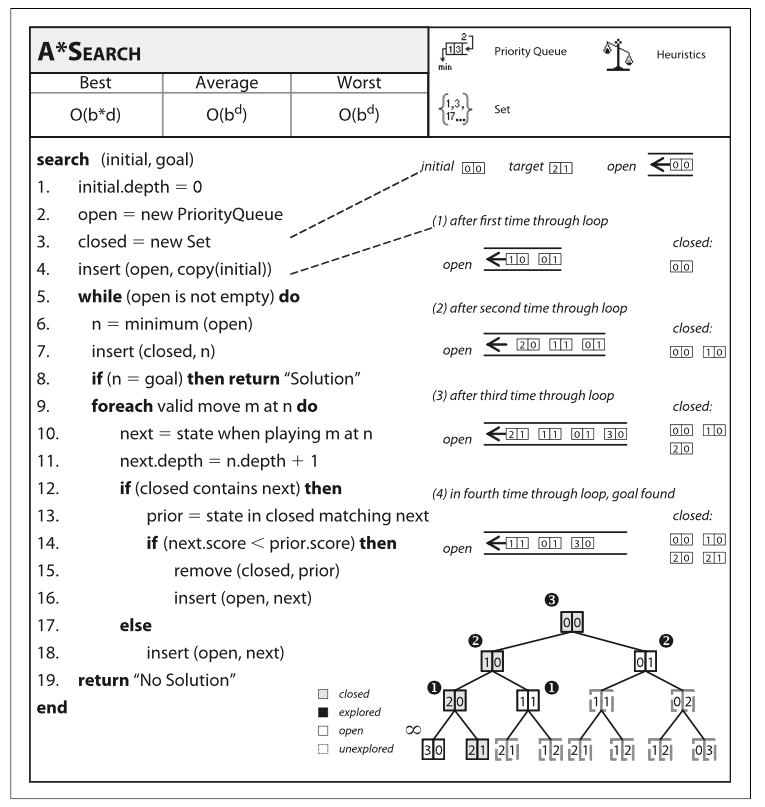

# A* Search Algorithm

## Objectives

* Comprehend A* algorithm
* Comprehend heuristic function

## Metrics/Desired Outcomes

* Implement A* algorithm
* Apply A* algorithm to a search problem

## Prelude to Path Finding for AI problems
* DFS -- blind search and may never terminate
* BFS -- guarantee to find solution if it exists
* Single-Source Shortest Path (Dijkstra's algorithm); greedy algorithm
* All Pairs Shortest Path - Floyd-Warshall algorithm; builds a matrix with dynamic programming
* MST (minimum spanning tree) - Prim's Algorithm; greedy algorithm

## Background on A*

* Is used for path finding and graph traversal
* Has universal appeals including a number of optimization and AI problems
* Excellent for unexplored graphs
* E. Dijkstra Search algorithm was introduced in 1959 
* P. Hart N. Nilsson and B. Raphael introduced A* in 1968
  * Each of them worked on different versions: A1, A2 

## Algorithm description

* Based on BFS: start Start node to some goal node 
* Traverse the graph and build up tree of partial paths
  * Use of trees implies no cycle
* Consider total cost
  * Use actual current cost **and** estimate future cost
  * Improvement of some modified BFS algorithms when only best next neighbors are considered
* Maintain a priority queue
  * Keep all considerations (pseudo back tracking)
  * A path might not be considered now -- but have some value down the road

### Key Intutition
Cost function f(n) = g(n) + h(n)
* f(n) is the cost of the function at node n; used as for placement in priority queue
* g(n) is the cost of getting to node n
* h(n) is the heuristic (estimation) for getting from n to goal node

Source: G. Heineman. Alorithms in a Nutshell.

## Analysis of the algorithm

* Heuristic function must be **admissible**
  * Must never overestimate the cost to goal h(x) <=  d(x,y) + h(y)
* Performance worst case: O(b^d)
  * b is the branching factor
  * d is the depth 
* Average case: O(b^d) 
* Best case: O(b*d)

## Related algorithms
* Iterative deepening
* Transposition tables
* Hierarchy
* Memory-bounded

