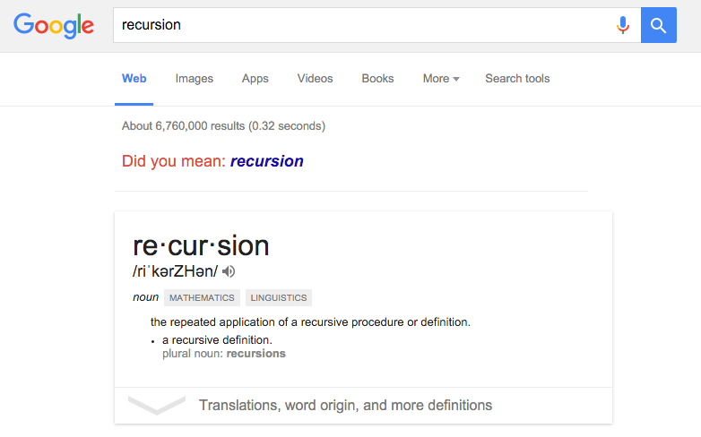

# Objectives

* Homework 1 Announcement
* Recap of Graph
* DFS (Depth First Search)
* Recursion Review
* BFS (Breadth First Search)

# Metrics/Desired Outcomes

* Understanding BFS/DFS
* Able to implement BFS/DFS

# Information

## Recap of Graph

* Graph
* Node
* Edge

> Graph is just an abstract data structure you can use to traverse and reason behind
certain problem.

### Examples

* Map
* Maze
* Game Tree
* http://visualgo.net/dfsbfs.html
* http://qiao.github.io/PathFinding.js/visual/

> We have data now, how do we process it to produce a useful output?

## Depth First Search (DFS)


### Pseudocode

```javascript
function DFS(v) {
    // label v as discovered
    for (node in Graph.neighbors(v)) {
        if (!node.isDiscovered()) {
            DFS(n);
        }
    }
}
```
## Recursion Review



* Base case
* Induction

## Breadth First Search (BFS)


### Pseudocode

```javascript
function BFS(v) {
    for (node in G) {
        node.distance = Number.MAX_VALUE;
        node.parent = null;
    }

    // create empty queue Q      
    var queue = new Queue();

    v.distance = 0;
    queue.enqueue(v);

    while (!queue.isEmpty()) {
        var u = queue.dequeue();
    
        for (node in Graph.neighbors(u)) {
            if (node.distance == Number.MAX_VALUE) {
                node.distance = u.distance + edge.value 
                // note that I'm leaving edge value up to 
                // you to implement
                node.parent = u;
                queue.enqueue(node);
            }
        }
    }
}
```