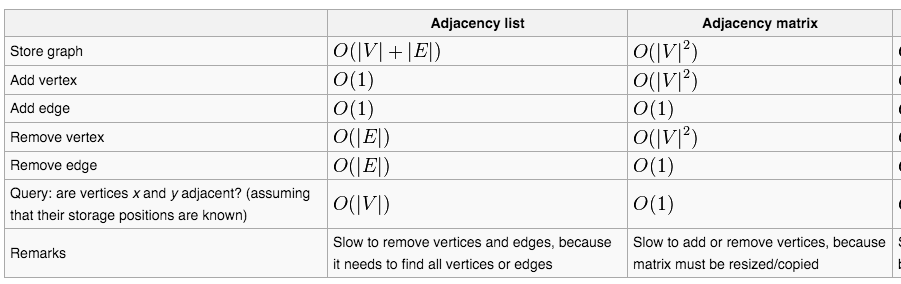

# Objectives

* Learn how to represent knowledge using Graph as data structure
* Homework 1 discussion

# Metrics/Desired Outcomes

* Understanding graphs theory
* Programming graphs
* Reading/writing graphs from/to file
* Basic graph traversal
* Complexity analysis (space and/or time)

# Information

## Knowledge Representation

### Examples

* Social network
* Map/city (locations)
* Job scheduling
* Game States

### Types of Graphs

* Directed/Undirected
* Weighted

### Best Practices

> Or at least good practices ...

* Abstract as graph data structure
* Abstract problems as states

## Graph as Abstract Data Structure

### 3 ways to represent graph

1. Adjacency Matrix
2. Adjacency List
3. Object Oriented

#### Complexity Analysis

### Components

* Node (vertex)
* Edge
* Graph

### Methods

* Adjacent
* Neighbors

## Graph Traversal Algorithms Overview

* Breadth First Search (BFS)
* Depth First Search (DFS)
* A-star
* Dijkstra
* Alpha-beta
* Min-max

# Learning

## Homework 1

Implement remaining code for graph package
